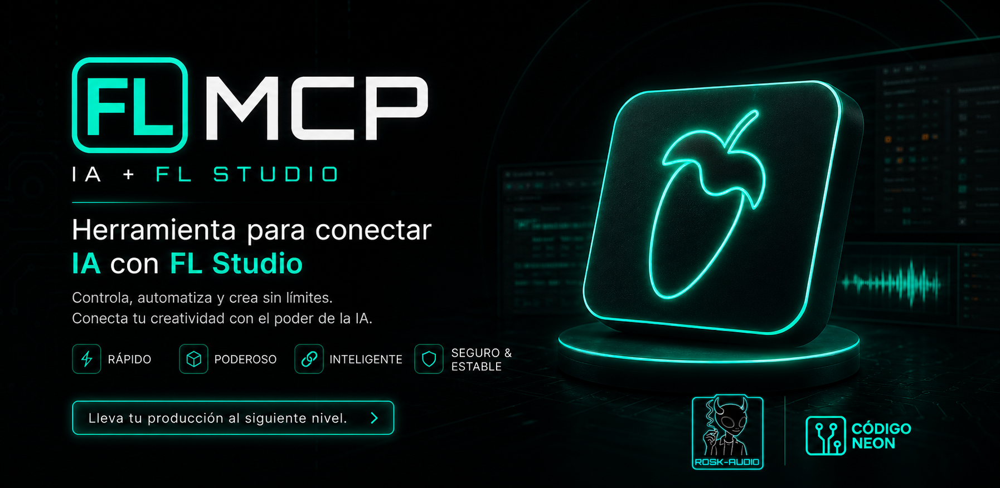

<p align="center">
  
</p>

# FL Studio MCP Server

**by Franco Donati**

Servidor MCP (Model Context Protocol) que conecta cualquier cliente MCP — **Claude Desktop, Claude Code, OpenCode, Cursor, Continue, Cline, Zed** — con FL Studio a traves de MIDI. Controla FL Studio desde una IA: genera beats, melodias, progresiones de acordes, lineas de bajo, configura el mixer, diseña sonidos en Serum 2, masteriza con Ozone 12, limpia audio con RX 11, y recibe guias de produccion profesional — todo con lenguaje natural.

Funciona en **Linux** (Kali, Ubuntu, etc.) con FL Studio corriendo en **Wine**, y en **Windows** con FL Studio nativo.

> Probado en producción con **Claude Desktop**, **Claude Code** y **OpenCode**. Cualquier cliente compatible con MCP (stdio) lo puede usar — ver [Configuracion del Cliente MCP](#configuracion-del-cliente-mcp) para los snippets de cada uno.

---

## Arquitectura

```
┌─────────────────────────────────────────────────────┐
│       CLIENTE MCP (Claude / OpenCode / Cursor...)   │
│                                                     │
│  trigger.py — FastMCP Server (1,839 lineas)         │
│  73 tools | 9 resources | 5 prompts                │
│                                                     │
│  knowledge/ — 18 modulos (12,098 lineas)            │
│  Escalas, acordes, drums, bass, plugins, mixing,    │
│  Ozone 12, FabFilter, Serum 2, Cymatics, RX 11,    │
│  Auto-Tune, sampling, productores, estructuras      │
│                                                     │
│  learned/ — Sistema de aprendizaje persistente      │
└──────────────────┬──────────────────────────────────┘
                   │ MIDI (bytes crudos)
                   │ /dev/snd/midiC0D0
                   ▼
┌──────────────────────────────────────────────────────┐
│                  VirMIDI (Linux)                      │
│              o loopMIDI (Windows)                     │
└──────────────────┬───────────────────────────────────┘
                   │
                   ▼
┌──────────────────────────────────────────────────────┐
│               FL STUDIO (Wine / Nativo)              │
│                                                      │
│  device_test.py — MIDI Script (976 lineas)           │
│  Recibe MIDI → Ejecuta API de FL Studio              │
│  11 comandos de mixer, grabacion en piano roll,      │
│  control de transporte y tempo                       │
└──────────────────────────────────────────────────────┘
```

La comunicacion es **unidireccional**: Claude envia comandos a FL Studio, pero no puede leer el estado actual del proyecto.

---

## Herramientas Disponibles (73 tools)

### Transporte y Control (5)

| Herramienta | Descripcion |
|---|---|
| `play` | Reproducir el proyecto |
| `stop` | Detener la reproduccion |
| `set_bpm` | Establecer BPM (20-999). Sincroniza con FL Studio |
| `get_bpm` | Ver BPM actual con contexto de genero y patrones compatibles |
| `list_midi_ports` | Listar puertos MIDI disponibles |

### Composicion y Generacion (7)

| Herramienta | Descripcion |
|---|---|
| `send_melody` | Grabar notas en el piano roll en tiempo real con compensacion de drift |
| `send_midi_note` | Enviar nota MIDI individual |
| `generate_drum_pattern` | Generar patron de bateria (9 estilos) |
| `generate_chord_progression` | Progresion de acordes (7 tipos, cualquier tonalidad) |
| `generate_bassline` | Linea de bajo adaptada al BPM (4 estilos) |
| `generate_scale_notes` | Notas de una escala en rango de octavas |
| `suggest_for_bpm` | Recomendaciones completas segun BPM |

### Mixer (11)

| Herramienta | Descripcion |
|---|---|
| `mixer_set_track_volume` | Volumen de pista (en dB) |
| `mixer_set_track_pan` | Paneo (-1.0 a 1.0) |
| `mixer_create_route` | Ruteo entre pistas (buses, sends, sidechain) |
| `mixer_mute_track` | Mutear/desmutear |
| `mixer_solo_track` | Solo toggle |
| `mixer_link_channel_to_track` | Conectar canal al mixer |
| `mixer_name_track` | Nombrar pista |
| `mixer_set_track_color` | Color RGB |
| `setup_sidechain` | Sidechain kick → bajo |
| `apply_mixer_template` | Template completo por genero |
| `get_sidechain_guide` | Guia de compresion sidechain |

### Mezcla y Procesamiento (14)

| Herramienta | Descripcion |
|---|---|
| `get_plugin_chain` | Cadena de plugins por elemento y genero |
| `get_vocal_processing` | Cadena vocal completa (10 slots) |
| `get_mastering_guide` | Cadena de mastering con targets LUFS |
| `get_mix_reference_levels` | Niveles de referencia y paneo |
| `get_eq_frequency_guide` | Guia de frecuencias EQ |
| `get_send_effects` | Sends: reverb, delay, compresion paralela |
| `get_bass_technique` | Tecnicas de bajo por genero |
| `get_bass_growl_guide` | Guia de distorsion/growl |
| `get_mixing_checklist` | Checklist de mezcla paso a paso |
| `get_soundtoys_plugins_guide` | Guia Soundtoys para hip-hop |
| `get_advanced_mixing_workflow` | Workflow avanzado de mezcla |
| `get_bus_routing` | Setup de buses por genero |
| `get_velocity_guide` | Velocidades MIDI para programacion realista |
| `get_mixer_layout` | Layout recomendado del mixer |

### Ozone 12 — Mastering (4)

| Herramienta | Descripcion |
|---|---|
| `get_ozone_mastering` | Cadena completa de mastering por genero (20 modulos) |
| `get_ozone_quick_master` | Quick master simplificado (3-4 modulos) |
| `get_ozone_module_guide` | Guia detallada de modulo individual |
| `get_lufs_target` | Targets LUFS por genero y plataforma (Spotify, YouTube, Apple, SoundCloud) |

### FabFilter — Mixing Suite (4)

| Herramienta | Descripcion |
|---|---|
| `get_fabfilter_eq` | Pro-Q 4 presets por elemento (frecuencias, gain, Q, shape) |
| `get_fabfilter_compressor` | Pro-C 3 presets (threshold, ratio, attack, release, style) |
| `get_fabfilter_mixing_chain` | Cadena FabFilter-only para vocal, drums, 808, master |
| `get_saturation_guide` | Saturn 2: saturacion multibanda por contexto |

### Serum 2 — Sound Design (3)

| Herramienta | Descripcion |
|---|---|
| `get_serum_patch` | Receta paso a paso de patch (808, lead, pad, pluck, keys, cowbell) |
| `get_serum_sounds_for_genre` | Sonidos recomendados por genero |
| `get_serum_sound_design` | Tecnicas: wavetables, FM, resampling, macros |

### Cymatics — Effects (2)

| Herramienta | Descripcion |
|---|---|
| `get_cymatics_plugin_chain` | Cadena Diablo/Pluto/Space/Quake/Vortex por genero |
| `get_cymatics_plugin_guide` | Guia de plugin individual con parametros |

### Auto-Tune Pro — Vocal Tuning (3)

| Herramienta | Descripcion |
|---|---|
| `get_autotune_guide` | Settings por estilo: natural, moderate, hard_tune, extreme |
| `get_vocal_tuning_guide` | Workflow completo de grabacion a vocal tuneada |
| `get_key_detection` | Deteccion de tonalidad con Auto-Key |

### iZotope RX 11 — Audio Repair (3)

| Herramienta | Descripcion |
|---|---|
| `get_rx_cleanup` | Cadena de limpieza por fuente: vinyl, YouTube, vocal, campo |
| `get_rx_module_guide` | Guia de modulo (13 modulos: de-noise, de-click, de-ess...) |
| `get_rx_overview` | Workflow general de reparacion |

### Sampling y Produccion (4)

| Herramienta | Descripcion |
|---|---|
| `get_sampling_guide` | Workflow de sampling por fuente (vinyl, YouTube, packs) |
| `get_chopping_technique` | Tecnicas de chopping (manual, Slicex, por bar, stutter) |
| `get_drum_machine_guide` | Emulacion de MPC 60, SP-1200, MPC 3000 en FL Studio |
| `get_sample_processing` | Cadena de procesamiento de samples |

### Analisis y Recomendaciones (6)

| Herramienta | Descripcion |
|---|---|
| `suggest_scale` | Escalas por genero y mood |
| `suggest_progression` | Progresiones por tonalidad, genero y mood |
| `suggest_plugin_chain` | Cadena inteligente usando TUS plugins instalados |
| `get_producer_info` | Perfil de 13 productores legendarios |
| `get_song_structure_template` | Estructura de cancion por genero |
| `get_quick_start_guide` | Guia de 10 pasos para hacer un beat |

### Aprendizaje y Analisis (4)

| Herramienta | Descripcion |
|---|---|
| `save_favorite_pattern` | Guardar patron exitoso para referencia futura |
| `get_favorite_patterns` | Recuperar patrones guardados |
| `analyze_midi` | Analizar MIDI: detectar key, escala, rango, duracion |
| `get_learned_context` | Resumen de preferencias aprendidas |

---

## Knowledge Base — 18 Modulos, 12,098 Lineas

### Composicion y Teoria

| Modulo | Lineas | Contenido |
|---|---|---|
| `scales.py` | 172 | 8 escalas con intervalos, mood, recomendaciones por genero |
| `chords.py` | 263 | 12 tipos de acordes, 7 progresiones transponibles |
| `drum_patterns.py` | 458 | 9 patrones con step/velocity, swing, BPM ranges |
| `basslines.py` | 1,128 | 4 estilos de bajo, procesamiento, reglas de oro |

### Mezcla y Produccion

| Modulo | Lineas | Contenido |
|---|---|---|
| `plugin_chains.py` | 2,503 | Cadenas de plugins, EQ, mastering, gain staging, LUFS |
| `vocal_chains.py` | 1,456 | Cadenas vocales de 10 slots, trucos, checklist |
| `mixing_advanced.py` | 892 | Gain staging avanzado, buses, mezcla paso a paso |
| `sampling.py` | 993 | Chopping, pitch, time-stretch, drum machines, layering |

### Plugins Especificos

| Modulo | Lineas | Plugins Cubiertos |
|---|---|---|
| `ozone12.py` | 654 | 20 modulos Ozone 12, 5 cadenas mastering, LUFS por plataforma |
| `fabfilter.py` | 564 | Pro-Q 4, Pro-C 3, Pro-L 2, Pro-R 2, Saturn 2 con presets |
| `serum2.py` | 634 | 8 recetas de patches, sound design, wavetables, FX chains |
| `cymatics.py` | 375 | Diablo, Pluto, Space, Quake, Vortex con presets por genero |
| `autotune.py` | 342 | Auto-Tune Pro + Auto-Key, 4 estilos, workflow vocal |
| `rx11.py` | 646 | 13 modulos RX 11, 5 workflows de limpieza |

### Referencia

| Modulo | Lineas | Contenido |
|---|---|---|
| `producers.py` | 331 | 13 productores legendarios con guias de replicacion |
| `song_structures.py` | 251 | Templates de estructura, transiciones |
| `constants.py` | 97 | Mapeo MIDI, nombres de notas, enums |
| `learned/user_learning.py` | 339 | Sistema de aprendizaje persistente (JSON) |

---

## Plugins Soportados

El sistema tiene conocimiento especializado para estos plugins instalados:

### Mixing / Mastering
- **FabFilter Pro-Q 4** — EQ parametrico (presets por elemento)
- **FabFilter Pro-C 3** — Compresor (8 estilos, presets por genero)
- **FabFilter Pro-L 2** — Limiter (presets por genero y LUFS target)
- **FabFilter Pro-R 2** — Reverb (presets por contexto)
- **FabFilter Saturn 2** — Saturacion multibanda
- **FabFilter Pro-DS** — De-esser
- **FabFilter Pro-MB** — Compresor multibanda
- **iZotope Ozone 12** — 21 modulos de mastering
- **SoundToys** — 18 plugins de efectos creativos

### Sintesis
- **Serum 2** — Sound design (8 recetas de patches, wavetables)

### Efectos Creativos
- **Cymatics Diablo** — Distorsion/saturacion
- **Cymatics Pluto** — Reverb
- **Cymatics Space** — Delay
- **Cymatics Quake** — Sub bass enhancer
- **Cymatics Vortex** — Modulacion (chorus/flanger/phaser)

### Vocal
- **Antares Auto-Tune Pro** — Tuning (4 estilos: natural a extreme)
- **Antares Auto-Key** — Deteccion de tonalidad

### Audio Repair
- **iZotope RX 11** — 13 modulos de limpieza (de-noise, de-click, de-ess, etc.)

---

## Generos Soportados

| Genero | BPM | Escalas | Caracter |
|---|---|---|---|
| **Boom Bap** | 80-95 | Menor natural, pentatonica | Drums secos, swing 60%, samples de vinyl |
| **Jazz Hip-Hop** | 75-95 | Dorica, menor natural | Acordes min7/maj9, swing alto, dinamico |
| **Lo-fi** | 70-90 | Pentatonica, menor | Bitcrush, cinta, rolled-off highs |
| **Trap** | 130-160 | Menor natural, frigia | 808 sustain, hi-hats rapidos |
| **Phonk** | 130-145 | Menor natural, frigia | Memphis, 808 distorsionado, oscuro |
| **UK Drill** | 140-145 | Frigia, menor armonica | 808 slides, dark |
| **Reggaeton** | 85-100 | Menor natural | Dembow pattern |

---

## Patrones, Escalas y Progresiones

### 9 Patrones de Bateria
`boom_bap_basic` · `premier_style` · `pete_rock_groove` · `havoc_minimal` · `dilla_drunk` · `9th_wonder_clean` · `rza_wu_tang` · `advanced_2bar` · `trap_basic`

### 8 Escalas
Menor Natural · Pentatonica Menor · Blues · Dorica · Menor Armonica · Frigia · Mayor · Pentatonica Mayor

### 7 Progresiones de Acordes
`classic_dark` · `jazz_hiphop` · `soul_feel` · `melancholic` · `minimal_jazz` · `phrygian_dark` · `neo_soul`

### 4 Estilos de Bajo
`root_follow` · `808_sustain` · `walking` · `octave_bounce`

### 13 Productores
DJ Premier · Pete Rock · RZA · J Dilla · 9th Wonder · Madlib · Havoc · Large Professor · Alchemist · Hi-Tek · Buckwild · Lord Finesse · Marley Marl

---

## Sistema de Aprendizaje

El MCP aprende de tus preferencias y mejora con el uso:

- **Patrones favoritos** — Guarda basslines, melodias, drums que te gustaron con rating
- **Preferencias** — Escalas, progresiones, estilos que preferis por genero
- **Historial** — Tracking de tools mas usados y exitosos
- **Analisis MIDI** — Analiza archivos MIDI exportados para detectar key, escala, rango

Los datos se persisten en archivos JSON en `knowledge/learned/data/`.

---

## Protocolo MIDI

| Protocolo | Nota Inicio | Nota Fin | Uso |
|---|---|---|---|
| Grabacion melodia/bajo | 76 | 77 | Activa rec+play → notas en tiempo real → stop |
| Tempo | 72 | 73 | BPM codificado en bytes MIDI |
| Mixer | 74 | 75 | Comando + parametros del mixer |

### Calibracion de Timing

La grabacion en tiempo real requiere compensacion de drift por BPM:

| BPM | Drift | Nota |
|---|---|---|
| 80 | 1.0 (ninguno) | Timing preciso sin compensacion |
| 90 | 1.21 | Compensa compresion de 0.826x |

Delay de arranque despues de Note 76: **0.05s** (no mas).

---

## Instalacion

### Linux (Kali, Ubuntu, etc.)

```bash
# 1. Cargar modulo VirMIDI
sudo modprobe snd-virmidi

# 2. Conectar VirMIDI a Wine ALSA
aconnect 20:0 128:0  # ajustar numeros segun tu sistema

# 3. Instalar dependencias
pip install mcp mido

# 4. Copiar device_test.py a FL Studio
# ~/.flstudio_prefix/drive_c/.../FL Studio/Settings/Hardware/

# 5. En FL Studio: MIDI Settings > seleccionar "Test Controller"

# 6. Configurar en Claude Desktop o Claude Code
```

### Windows

```powershell
# 1. Instalar loopMIDI (crear puerto "MCP-FL")
# https://www.tobias-erichsen.de/software/loopmidi.html

# 2. Instalar dependencias
pip install mcp mido python-rtmidi

# 3. Copiar device_test.py a:
# C:\Program Files\Image-Line\FL Studio 2024\Settings\Hardware\

# 4. En FL Studio: MIDI Settings > Input "MCP-FL" > Controller "Test Controller"
```

### Configuracion del Cliente MCP

El servidor es un MCP estandar (stdio), asi que funciona con **cualquier cliente compatible con Model Context Protocol**. Aca estan las configuraciones para los mas comunes:

#### Claude Desktop

Archivo: `claude_desktop_config.json`
- Linux: `~/.config/Claude/claude_desktop_config.json`
- Windows: `%APPDATA%\Claude\claude_desktop_config.json`
- macOS: `~/Library/Application Support/Claude/claude_desktop_config.json`

```json
{
  "mcpServers": {
    "flstudio": {
      "command": "python",
      "args": ["/ruta/completa/a/trigger.py"]
    }
  }
}
```

#### Claude Code

Comando rapido:
```bash
claude mcp add flstudio python /ruta/completa/a/trigger.py
```

O manualmente en `~/.claude.json` (global) o `.claude/settings.json` (por proyecto):
```json
{
  "mcpServers": {
    "flstudio": {
      "command": "python",
      "args": ["/ruta/completa/a/trigger.py"]
    }
  }
}
```

#### OpenCode

Archivo: `opencode.json` (raiz del proyecto) o `~/.config/opencode/opencode.json` (global).

```json
{
  "$schema": "https://opencode.ai/config.json",
  "mcp": {
    "flstudio": {
      "type": "local",
      "command": ["python", "/ruta/completa/a/trigger.py"],
      "enabled": true
    }
  }
}
```

Reiniciar OpenCode despues de editar. Para verificar: `/mcp` dentro de la TUI listara `flstudio` con sus 73 tools.

#### Otros clientes (Cursor, Continue, Cline, Zed)

Todos siguen la misma idea: `command: "python"`, `args: ["/ruta/a/trigger.py"]`. Consultar la doc del cliente para la ubicacion exacta del archivo de config.

### Verificacion

Antes de usar el MCP, asegurate de que:

1. **FL Studio esta abierto** con un proyecto cargado
2. **`device_test.py` esta corriendo** como MIDI Script (MIDI Settings > Controller > "Test Controller")
3. **El puerto MIDI esta conectado**:
   - Linux: `aconnect -l` debe mostrar VirMIDI → WINE ALSA Input
   - Windows: loopMIDI con puerto `FL_MCP` activo
4. **El cliente reconoce el server**: en Claude Code `claude mcp list`, en OpenCode `/mcp`

---

## Estructura del Proyecto

```
FL MCP/
├── trigger.py                    # Servidor MCP (1,839 lineas, 73 tools)
├── device_test.py                # MIDI script FL Studio (976 lineas)
├── knowledge/                    # Base de conocimiento (12,098 lineas)
│   ├── scales.py                 # 8 escalas con teoria
│   ├── chords.py                 # 12 acordes, 7 progresiones
│   ├── drum_patterns.py          # 9 patrones con velocity
│   ├── basslines.py              # 4 estilos de bajo
│   ├── plugin_chains.py          # Cadenas de plugins, EQ, mastering
│   ├── vocal_chains.py           # Procesamiento vocal completo
│   ├── mixing_advanced.py        # Mezcla avanzada, buses, gain staging
│   ├── sampling.py               # Sampling, chopping, drum machines
│   ├── ozone12.py                # iZotope Ozone 12 (mastering)
│   ├── fabfilter.py              # FabFilter Suite (mixing)
│   ├── serum2.py                 # Serum 2 (sound design)
│   ├── cymatics.py               # Cymatics plugins (effects)
│   ├── autotune.py               # Auto-Tune Pro (vocal tuning)
│   ├── rx11.py                   # iZotope RX 11 (audio repair)
│   ├── producers.py              # 13 productores legendarios
│   ├── song_structures.py        # Estructuras de cancion
│   ├── constants.py              # Constantes MIDI y enums
│   └── learned/                  # Sistema de aprendizaje
│       └── user_learning.py      # Patrones, preferencias, historial
├── CLAUDE.md                     # Guia de desarrollo y calibracion
├── README.md                     # Este archivo
└── requirements.txt              # Dependencias Python
```

---

## Ejemplos de Uso

```
"Poneme 80 BPM y haceme un bajo en D# menor de 8 compases estilo boom bap"
→ set_bpm(80) + generate_bassline + send_melody

"Que cadena de mastering me recomendas para trap?"
→ get_ozone_mastering("trap") — cadena Ozone 12 completa con settings

"Haceme un patch de 808 distorsionado en Serum"
→ get_serum_patch("808_distorted") — receta paso a paso

"Como limpio este sample de vinyl?"
→ get_rx_cleanup("vinyl_sample") — RX 11: De-click → De-crackle → De-noise

"Dame el EQ para las vocales con Pro-Q 4"
→ get_fabfilter_eq("vocals") — 5 bandas con frecuencias exactas

"Configurame el Auto-Tune para trap"
→ get_autotune_guide("hard_tune") — Retune 0ms, Humanize 0, Flex 0

"Como hacian beats en el MPC 60?"
→ get_drum_machine_guide("mpc_60") — 12-bit, 40kHz, emulacion en FL

"Armame el mixer completo para boom bap"
→ apply_mixer_template("boom_bap") — nombres, colores, buses, sidechain

"Analizame este MIDI que exporte"
→ analyze_midi("archivo.mid") — key, escala, rango, notas, duracion

"Quiero hacer un beat al estilo de J Dilla"
→ get_producer_info("j_dilla") — MPC 3000, swing extremo, samples, tips
```

---

## Numeros

| Metrica | Cantidad |
|---|---|
| Tools MCP | 73 |
| Resources MCP | 9 |
| Prompts MCP | 5 |
| Modulos de knowledge | 18 |
| Lineas de knowledge | 12,098 |
| Lineas de trigger.py | 1,839 |
| Lineas de device_test.py | 976 |
| Generos soportados | 7 |
| Patrones de drums | 9 |
| Escalas | 8 |
| Progresiones | 7 |
| Estilos de bajo | 4 |
| Perfiles de productores | 13 |
| Plugins con guias | 40+ |

---

## Disclaimer

Las referencias a productores, artistas y marcas de plugins (FabFilter, iZotope, Antares, Cymatics, Image-Line, Serum, etc.) son nominativas y con fines **educativos e informativos** unicamente. Este proyecto no esta afiliado, patrocinado ni endosado por ninguno de ellos. Los nombres de productores se usan para describir tecnicas y estilos historicos de produccion; no se incluyen samples, audio, letras, fotos ni logos protegidos por derechos de autor.

---

## Licencia

Proyecto de **Franco Donati**. Uso personal y educativo.
